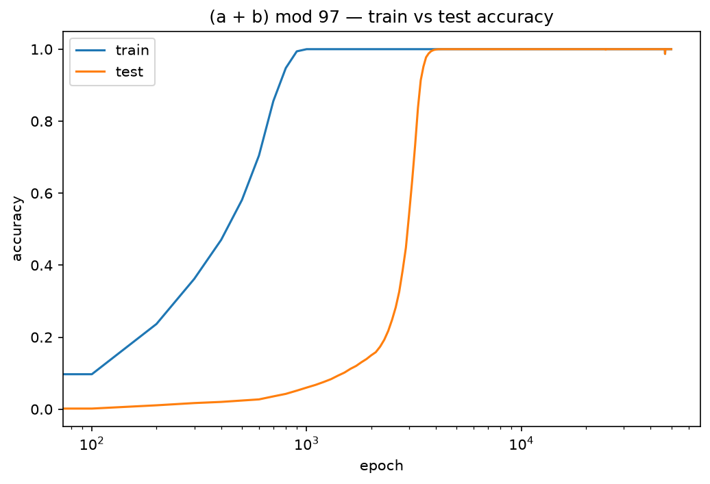

# replica
Paper Replication

## Grokking

Replication of [Power et al. 2022](https://arxiv.org/abs/2201.02177)

#### Setup
- Task: `(a + b) mod 97`, all p² pairs, tokens `[a, b, =]`, answer read at the last position
- Model: 1-layer decoder-only transformer written from scratch (single-head attention along with MLP, residuals and embed), d_model=128, 207k params
- Training: full-batch AdamW, lr=1e-3, **weight_decay=1.0**, cross-entropy, 30% train fraction, 50k epochs

#### What makes it work
Strong weight decay and a limited train fraction, jointly. Decay keeps pressuring the model to make the switch from pure categories to modelling actual mathematical relations.
Almost like we make it recognise the numbers without telling it what they are. The gap is the difference between categorical binning and this understanding.
